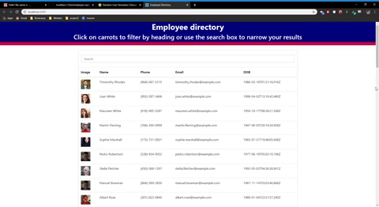

## Employee-Searcher

## Table of contents

- [General info](#general-info)
- [Instructions](#instructions)
- [Technologies](#technologies)
- [Dependencies](#dependencies)
- [Github Link](#github-link)

## Demo

## General Info

This react application displays fifty employees generated by the RandomUser.Me API.  Filter through the employees by typing into the search bar. The information displayed of all employees include a photo, name, phone number, email, and date of birth.

## Instructions

In order to use the application, be sure to install all of the dependencies (see below). From there, the user will be shown the fifty randomly generated employees. If the user would like filter through the employees, they must simply start typing into the search bar.  From there it will filter through the employees according to what is typed in updating with each letter.

## Technologies

- React
- Bootstrap
- RandomUser.Me API

## Dependencies

- axios: "^0.19.2",
- react: "^16.13.0",
- "react-dom": "^16.13.0",
- "react-scripts": "3.4.0"

## Github Link

https://github.com/jonathan-j-choi/employee-search